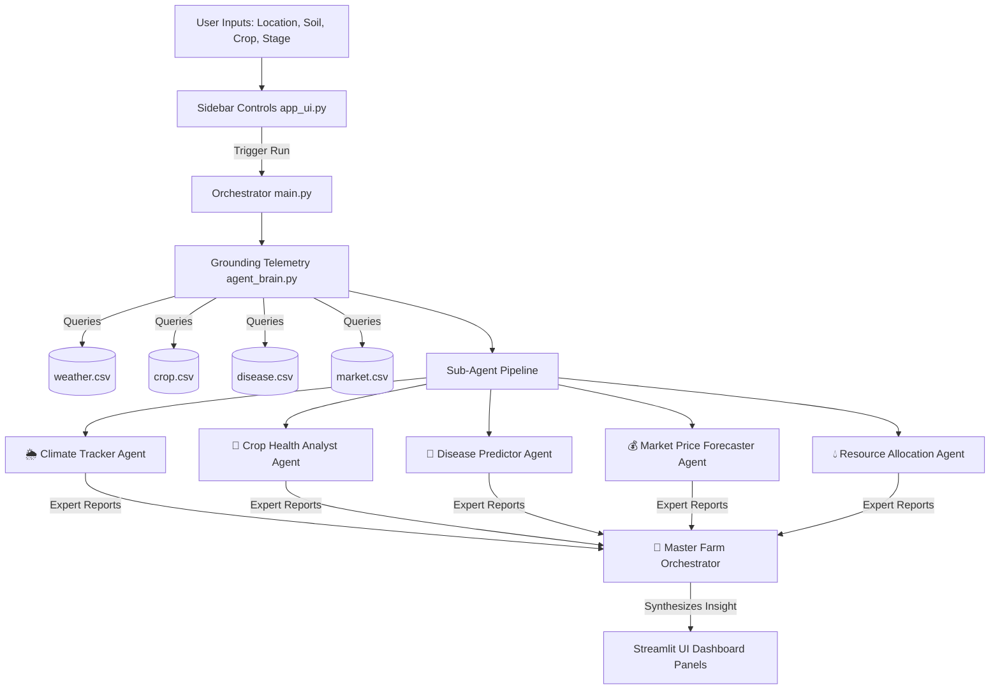

# 🚜 AgriShield AI: Climate Risk & Farm Decision Agent

AgriShield AI is an intelligent, multi-agent agricultural risk-management and decision-support system designed to empower farmers with localized, data-grounded insights. By running a collaborative network of five specialized AI sub-agents orchestrated by a Master Farm Decision Agent, AgriShield AI synthesizes complex weather, biological, pathological, and economic signals into immediate, high-priority action plans.

---

## 📋 Table of Contents
1. [Problem Statement](#-problem-statement)
2. [Why Agents?](#-why-agents)
3. [System Architecture](#-system-architecture)
4. [Tech Stack & Build Tools](#-tech-stack--build-tools)
5. [Local Setup Instructions](#-local-setup-instructions)
6. [Production Deployment Guide](#-production-deployment-guide)
7. [Repository File Map](#-repository-file-map)

---

## ⚡ Problem Statement
Modern agriculture is increasingly exposed to volatile, localized climate risks, rising pest and disease pressures, and fluctuating global market conditions. Farmers are often overwhelmed by disconnected data sources: raw weather feeds, general crop care instructions, regional disease warnings, and commodity market tickers. 

Without a way to integrate, localize, and contextualize these indicators, farmers struggle to answer critical daily questions:
* *Should I increase irrigation today given the heatwave, even if water costs are high?*
* *Is my current crop growth stage vulnerable to immediate pathogen outbreaks?*
* *Will regional trade barriers affect my current harvest's pricing?*

AgriShield AI solves this problem by collecting localized parameters and running a coordinated team of expert AI sub-agents to deliver a single, unified, actionable daily farm briefing.

---

## 🤖 Why Agents?
Large Language Models (LLMs) excel at processing information but struggle with domain-specific planning when forced to evaluate multiple conflicting dimensions (like saving water vs. protecting crop yields under heat stress) in a single run.

AgriShield AI addresses this by deploying a **Multi-Agent Orchestration Architecture**:
1. **Division of Labor**: Each agent acts as a dedicated domain expert (Climatologist, Agronomist, Plant Pathologist, Commodity Trader, and Resource Engineer) focusing exclusively on its area of intelligence.
2. **Local Data Grounding**: Hallucinations are mitigated by feeding specific, case-matched parameters extracted from local CSV database layers directly into each sub-agent's prompt context.
3. **Synthesis & Prioritization**: The **Master Farm Decision Orchestrator** acts as the executive manager, digesting the individual sub-agent reports and synthesizing them into a high-priority, strategic action plan for the farmer.

---

## 🧠 System Architecture

The following diagram illustrates how user parameters are grounded, processed sequentially by specialized sub-agents, and synthesized by the Master Orchestrator:



### Specialized Sub-Agents:
1. **🌦️ Climate & Weather Tracker**: Analyzes atmospheric metrics (temperature, humidity, rainfall) and issues severe weather risk warnings.
2. **🌱 Crop Health Analyst**: Evaluates crop phenotype parameters and growth constraints under specific soil taxonomy conditions.
3. **🦠 Disease Vector Predictor**: Compares common pathogens and environmental triggers against localized forecast data to estimate outbreak risks.
4. **💰 Market Price Forecaster**: Tracks regional pricing benchmarks, demand indices, and commercial price trends.
5. **💧 Resource Allocation Planner**: Formulates dynamic irrigation adjustments and resource conservation planning directives.

---

## 🛠️ Tech Stack & Build Tools
* **Frontend UI**: [Streamlit](https://streamlit.io/) (for building clean, professional, stateful Python web interfaces)
* **LLM Engine**: `gemini-2.5-flash` accessed via the official modern [Google GenAI SDK](https://github.com/google-gemini/generative-ai-python)
* **Data Processing**: [Pandas](https://pandas.pydata.org/) (for matching local data layers)
* **Environment Control**: `python-dotenv` (for secure API key loading)

---

## 💻 Local Setup Instructions

### Prerequisites
* Python 3.10 or higher installed.
* A Gemini API key (obtainable for free from [Google AI Studio](https://aistudio.google.com/)).

### 1. Clone & Navigate to Repository
```bash
git clone https://github.com/vinithreddy547/Agri-Shield-Ai.git
cd Agri-Shield-Ai
```

### 2. Install Dependencies
```bash
pip install -r requirements.txt
```

### 3. Configure Secrets
Create a `.env` file in the root directory of the project:
```env
GEMINI_API_KEY=your_gemini_api_key_here
```
*(Note: The `.env` file is excluded from git tracking via `.gitignore` to prevent credential exposure).*

### 4. Run the Application
Start the Streamlit dashboard locally:
```bash
python -m streamlit run main.py
```
Open **`http://localhost:8501`** in your browser.

### 5. Running the MCP Telemetry Server
Expose the agricultural telemetry lookup databases as standard Model Context Protocol (MCP) tools for external AI clients:
```bash
python mcp_server.py
```
This launches the server over stdio, ready to be configured as an MCP client integration in tools like Claude Desktop, Cursor, or other agents.

---

## 🔒 Security Features
AgriShield AI is built with modern agent security practices:
1. **Input Sanitization**: All dashboard parameters (`location`, `crop_type`, `growth_stage`, `soil_type`) pass through a regex and string block-list validator (`sanitize_input` in `agent_brain.py`) to prevent LLM prompt injection and prompt leaks.
2. **Quota & API Resilience**: Dynamic offline generators fall back to offline CSV telemetry layers if the Gemini API encounters HTTP 503 or quota limits, safeguarding uptime.
3. **Environment Security**: Sensitive API credentials (`GEMINI_API_KEY`) are managed strictly through `.env` variables and kept out of public configuration files.

---

## 🌐 Production & Container Deployment Guide

### Option A: Hugging Face Spaces Deployment
1. Create a new Space on [Hugging Face Spaces](https://huggingface.co/new-space):
   * **Space name**: `agrishield-ai`
   * **SDK**: `Streamlit`
   * **License**: `apache-2.0`
   * **Visibility**: `Public`
2. Go to the Space's **Settings** tab, scroll to **Variables and secrets**, and add a new secret:
   * **Name**: `GEMINI_API_KEY`
   * **Value**: Your Google Gemini API Key.
3. Commit and push the project files:
   ```bash
   git remote add hf https://huggingface.co/spaces/YOUR_USERNAME/agrishield-ai
   git push -f hf main
   ```
### Option B: Streamlit Community Cloud Deployment
1. Push your project code to a public GitHub repository (e.g. `https://github.com/vinithreddy547/Agri-Shield-Ai`).
2. Go to [share.streamlit.io](https://share.streamlit.io/) and log in using your GitHub account.
3. Click **Create app** (or **Deploy an app**).
4. Fill in the repository details:
   * **Repository**: `vinithreddy547/Agri-Shield-Ai` (or your fork)
   * **Branch**: `main`
   * **Main file path**: `main.py`
5. Click **Advanced settings** before deploying, go to **Secrets**, and paste your API key in TOML format:
   ```toml
   GEMINI_API_KEY = "your_actual_gemini_api_key_here"
   ```
6. Click **Deploy!** Your app will be live at a custom sub-domain.

### Option C: Docker Container Deployment (Cloud/Local)
AgriShield is fully containerized using the provided `Dockerfile`. To build and run:
1. Build the Docker Image:
   ```bash
   docker build -t agrishield-ai .
   ```
2. Run the Container:
   ```bash
   docker run -p 8501:8501 --env GEMINI_API_KEY=your_key_here agrishield-ai
   ```
3. Access the dashboard at **`http://localhost:8501`**.

---


## 📂 Repository File Map
* **`main.py`**: The application entry point managing layout rendering, event handling, and pipeline coordination.
* **`app_ui.py`**: Contains custom CSS styles (dark mode glassmorphism) and dashboard page components.
* **`agent_brain.py`**: Houses the grounding lookups, input sanitization rules, and multi-agent pipeline orchestration logic.
* **`mcp_server.py`**: Model Context Protocol (MCP) server exposing local CSV database queries as tool parameters.
* **`requirements.txt`**: Pins project library dependencies.
* **`Dockerfile`**: Builds a containerized package for server deployments.
* **`data/`**: Relational grounding CSV dataset folder containing `weather.csv`, `crop.csv`, `disease.csv`, and `market.csv`.
* **`data_dictionary.md`**: Outlines schemas, data types, and brief descriptions for developer reference.